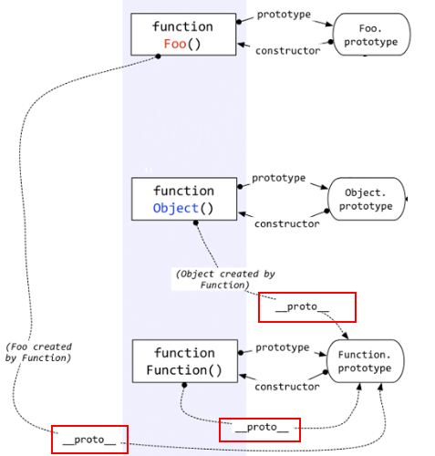

暂不支持查看！
<!--more-->
> 参考
> 深入理解javascript原型和闭包 [http://www.cnblogs.com/wangfupeng1988/p/3977924.html](http://www.cnblogs.com/wangfupeng1988/p/3977924.html)
> 深入分析js中的constructor 和prototype [http://www.cnblogs.com/yupeng/archive/2012/04/06/2435386.html](http://www.cnblogs.com/yupeng/archive/2012/04/06/2435386.html)

### 1. 一切都是对象 (值类型就不是对象)

> 对象——若干属性的集合。

typeof 输出的几种类型

基本数据类型 `undefined`、 `string`、 `number`、 `boolean`、 `null` & 复杂数据类型 `object`

基本类型 `undefined`、 `string`、 `number`、 `boolean`、 `null` & 引用类型 `object`、 `array`、 `function`、 `regexp` ...

```js
// 基本类型
console.log(typeof name) // undefined
console.log(typeof 'xlsluck') // string
console.log(typeof 22) // number
console.log(typeof true) // boolean
// 引用类型
console.log(typeof function(){}) // function

console.log(typeof [1, 2, 3]) // object
console.log(typeof {name: 'xlslucky'}) // object
console.log(typeof null) // object
```

### 2.函数和对象的关系

```js
  // 函数就是对象的一种 
  var fn = function () { };
  fn instanceof Object // true
  typeof fn // function

  // 对象可以通过函数来创建
  function Fn() {
    this.name = '小呀嘛小二郎';
    this.sex = 'boy';
  }
  var fn1 = new Fn();
  fn1.name // '小呀嘛小二郎'
  fn1.sex // 'boy'

  // 这是创建对象、数组的 语法糖
  var obj = {name: '小呀嘛小二郎'}
  var arr = [1, 2, 3]
```

### 3. prototype 原型

> 每个函数都有一个prototype, 每个对象都有一个__proto__

* 每个对象都是new Object()创建出来的，`o1、o2`的`__proto__`指向`创建他们的Object`的`prototype`属性。
* `Object`的`prototype`有`constructor`属性，指向`function Object(){}`这个构造函数。
* `function Object(){}`的`prototype`就是`Object.prototype`。


* Object.prototype确实一个特例——它的__proto__指向的是null，切记切记！





```javascript
// 我们在定义函数的时候，函数定义的时候函数本身就会默认有一个prototype的属性
// 而我们如果用new 运算符来生成一个对象的时候就没有prototype属性，但是这个对象有__proto__属性，指向实例的prototype

// 每个对象都有一个__proto__属性，指向创建该对象的函数的prototype

function Parent(name){
  this.name = name;
}
Parent.prototype.do = function (){
  console.log(this.name + ' can do everthing')
}
var child = new Parent('xuls');

typeof child.prototype // undefine
typeof Parent.prototype // object

child.__proto__ == Parent.prototype // true

// Parent.prototype 包涵两个属性，一个是constructor，另一个是__proto__
// constructor就是构造函数Parent
```

### 5. instanceof

> typeof 判断简单类型都很清除(string、boolean、number、undefined)，但是引用类型返回值只有(object、function)，不知道他是数组还是对象

```js
// 沿着f1的__proto__、Foo的prototype来找，如果两条线能找到同一引用，那就返回true
function Foo(){}
var f1 = new Foo();
f1 instanceof Foo // true
f1 instanceof Object // true
```


### 6. 继承

> javascript是通过原型链来实现继承

> 所有对象的原型链都会找到Object.prototype，因此所有的对象都会有Object.prototype的方法。这就是继承；

```js
function Foo(){}
var f1 = new Foo();
f1.a = 10;
Foo.prototype.a = 100;
Foo.prototype.b = 200;
// 访问一个对象的属性时，先在基本属性中查找，如果没有，再沿着__proto__这条链向上找，这就是原型链。
f1.a // 10
f1.b // 200

// 验证是否是基本属性
// hasOwnProperty 这个方法在 Object.prototype里 
f1.hasOwnProperty('a') // true
f1.hasOwnProperty('b') // false
```

每个函数都有call、apply方法，都有length、caller等属性，函数由Function函数创建，继承了Function.prototype的方法。

### 8. 执行上下文、this

**this 永远指向最后调用它的那个对象**

**this 永远指向最后调用它的那个对象**

**this 永远指向最后调用它的那个对象**

准备工作
* 变量、函数表达式 ---- 变量声明，默认赋值undefined
* this ---- 赋值
* 函数声明 ---- 赋值

```js
console.log(a) // Uncaught ReferenceError: a is not defined
....
console.log(a) // undefined
var a;
....
console.log(a) // undefined
var a = 10;
....
console.log(f1) // undefined
var f1 = function(){} // 函数表达式
....
console.log(f2) // function f2(){}
function f2(){} // 函数声明
```

#### 8.1 this -- 构造函数

```js
function Foo () {
  this.name = '胥';
  this.age = '22';

  console.log(this)        // Foo { name: '胥', age: '22'}
}
var f1 = new Foo()

....

function Foo () {
  this.name = '胥';
  this.age = '22';

  console.log(this)        // Window { .... }
}
Foo();
```

#### 8.2 this -- 函数作为对象的一个属性

```js
// 如果函数作为对象的一个属性时，并作为对象的属性被调用，函数的this指向obj
var obj = {
  x: 10,
  fn: function (){
    console.log(this)      // obj { x: 10, fn: function(){....} }
    console.log(this.x)    // 10
  }
}
obj.fn()

// 当函数不作为对象的属性被调用
var obj = {
  x: 10,
  fn: function (){
    console.log(this)      // Window { .... }
    console.log(this.x)    // undefined
  }
}
var fn1 = obj.fn;
fn1()
// 如果函数被赋值到另一个变量中，并没有作为obj的属性被调用，那么this指向window
```

#### 8.3 this -- 函数用call或者apply调用

```js
var obj = {
  x: 10
}
function Foo () {
  console.log(this)
}

Foo()     // Window { .... }

Foo.call(obj)  // obj { x: 10 }
```

#### 8.4 this -- 全局 & 调用普通函数

```js
// 普通函数在调用时，其中的this也都是window。
var x = 10;
var fn = function () {
  console.log(this)      // Window { .... }
  console.log(this.x)    // 10
}
fn()

// 虽然函数f是在obj.fn内部定义， 但他仍然是普通函数，this指向window
var obj = {
  x: 10,
  fn: function () {
    function f () {
      console.log(this)       // Window { .... }
      console.log(this.x)     // undedined
    }
    f()
  }
}
obj.fn()
```

### 9. 执行上下文栈

> 没看懂

### 10. 作用域

> es5及之前都没有块级作用域，也就是 “{}” ，除了全局作用域，只有函数才能创建作用域。